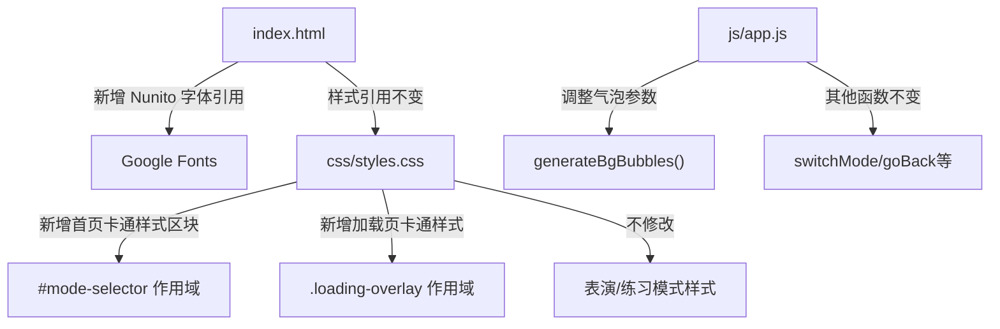

## 用户需求

首页（模式选择界面）重新设计，将当前暗黑科技风格改为卡通化、可爱化的色系风格。

## 产品概述

Six Little Ducks 是一个6人合唱互动播放器，首页包含模式选择（表演模式/练习模式）和角色选择功能。当前首页采用深色背景 + 半透明卡片的科技风设计，需要改为明亮、柔和、卡通化的视觉风格，与"小鸭子"儿童合唱的主题更加契合。

## 核心特征

- 首页背景从深黑色改为明亮柔和的浅色渐变，营造温馨可爱的氛围
- 加载页面同步改为卡通可爱风格
- 模式选择卡片改为圆润、有趣的卡通卡片样式，带柔和阴影和色彩
- 角色选择按钮更加饱满可爱，带弹性动画
- 背景装饰气泡增加更多卡通元素感（更大、更圆润、更鲜艳）
- 标题文字保持彩虹渐变但增加卡通手写感
- 仅改造首页和加载页，表演模式和练习模式的暗色界面不变
- 保持现有的响应式布局和6只鸭子的特征色（duck1-duck6）
- 保持所有交互功能不变

## 技术栈

- 纯 HTML / CSS / JavaScript（与现有项目一致）
- Google Fonts（新增 Nunito 圆润字体用于首页标题）
- 无需新增依赖

## 实现方案

### 策略概述

通过 CSS 变量隔离 + 选择器作用域限定，将首页（#mode-selector）和加载页（.loading-overlay）的视觉风格从暗黑科技风全面改造为卡通可爱风，同时确保表演模式和练习模式的暗色 UI 完全不受影响。

### 核心设计决策

1. **色系隔离**：在 `#mode-selector` 和 `.loading-overlay` 上通过 CSS 自定义属性覆盖，定义首页专属浅色系，不修改 `:root` 中的全局暗色变量，避免影响其他模式
2. **字体策略**：首页标题引入 Nunito（圆润感字体），副标题和正文复用 Poppins，表演/练习模式不变
3. **背景方案**：浅色暖调渐变背景 + 更大更饱满的彩色气泡 + CSS 波浪装饰底部
4. **卡片风格**：从半透明玻璃变为白色圆角卡片 + 柔和彩色阴影 + hover 弹跳动画
5. **角色按钮**：从暗色方块变为白色圆润胶囊按钮 + 选中时弹跳缩放 + 彩色底色填充

### 关键技术点

- 使用 `#mode-selector` 作用域前缀，所有首页样式覆盖都限定在首页容器内
- loading 页面使用 `.loading-overlay` 前缀限定
- JS 中 `generateBgBubbles()` 增加气泡透明度和尺寸，使其在浅色背景下更好看
- 响应式断点保持不变，仅调整首页相关的 media query 中的颜色/阴影值

## 实现注意事项

- **不修改 :root 全局变量**：新增 `#mode-selector` 和 `.loading-overlay` 的局部 CSS 变量覆盖
- **性能**：新增的 CSS 动画（弹跳、摇摆）使用 transform/opacity，避免触发 layout
- **向后兼容**：表演/练习模式继续使用 :root 的暗色变量，零影响
- **气泡调整**：JS 中 `generateBgBubbles()` 需调整气泡 opacity 和尺寸参数，浅色背景下气泡不宜太浓

## 架构设计

### 修改范围（仅首页 + 加载页）



### 样式作用域划分

- **首页专属**（新增/覆盖）：`#mode-selector`, `.loading-overlay`, 及其内部所有子元素
- **全局不变**（不触碰）：`:root` 变量、`#performance-mode`、`#practice-mode`、所有 toolbar/lyrics/formation 样式

## 目录结构

```
project-root/
├── css/
│   └── styles.css              # [MODIFY] 新增首页卡通化样式区块（约150行），覆盖 #mode-selector 和 .loading-overlay 的背景、卡片、按钮、文字颜色。在现有样式末尾（@keyframes fadeOut 之后）追加"首页卡通化重设"区块，使用高特异性选择器覆盖原有暗色样式。同时微调各响应式断点中首页相关的阴影和颜色值。
├── index.html                  # [MODIFY] head 中新增 Nunito 字体引用；loading-overlay 增加底部波浪装饰 div；mode-selector 增加底部波浪 SVG 装饰元素。
└── js/
    └── app.js                  # [MODIFY] generateBgBubbles() 函数调整气泡透明度从 0.15 改为 0.25，尺寸范围加大，增加圆形星星/爱心形状装饰元素混合。
```

## 设计风格

将首页从暗黑科技风彻底转变为明亮温暖的卡通可爱风格，与"六只小鸭子"儿童合唱的主题完美契合。

### 整体氛围

采用浅色暖调渐变背景，天空蓝到薄荷绿的柔和过渡，配合大面积圆角、柔和阴影和弹性动画，营造出童趣活泼的感觉。背景散布彩色半透明气泡，像糖果泡泡一样轻盈飘动。

### 页面布局（首页模式选择界面）

#### 加载页

- 背景改为柔和的浅蓝渐变（与首页一致）
- 进度条改为圆角彩虹糖果条，更粗更圆
- 加载文字使用暖色调深灰色，更易读
- 鸭子弹跳动画保持，增加轻微旋转摇摆

#### 标题区域

- 6只SVG鸭子保持原有parade动画，增加更大幅度的摇摆
- 标题 "Six Little Ducks" 使用 Nunito 字体（更圆润可爱），保持彩虹渐变，增加白色描边/阴影营造立体感
- 副标题文字颜色改为暖棕色调，字母间距保持

#### 模式选择卡片

- 卡片背景从半透明暗色改为纯白/浅奶油色
- 圆角加大到 28px，更饱满
- 卡片带有柔和的彩色阴影：表演模式带粉红色阴影，练习模式带薄荷绿阴影
- hover 时上浮 + 轻微放大 + 阴影扩散，弹性缓动
- 卡片内标题改为深色，描述文字改为中灰色
- 图标保持 emoji，尺寸不变

#### 角色选择区

- "选择你的角色"标题改为暖棕色
- 角色按钮从暗色方块改为白色圆润按钮，border 改为浅灰
- 选中态：背景填充对应鸭子颜色的浅色版（10%饱和度），边框变为鸭子颜色，柔和彩色阴影
- hover 弹跳动画更活泼

#### 背景装饰

- 彩色气泡在浅色背景下透明度提高到 0.2-0.3
- 气泡尺寸更大，颜色更饱满
- 新增少量星星/爱心形状的小装饰随机分布

## Agent Extensions

### MCP

- **github**
- Purpose: 完成首页卡通化改造后，通过 GitHub MCP 推送代码变更
- Expected outcome: 代码提交并推送到远程仓库，保持版本同步